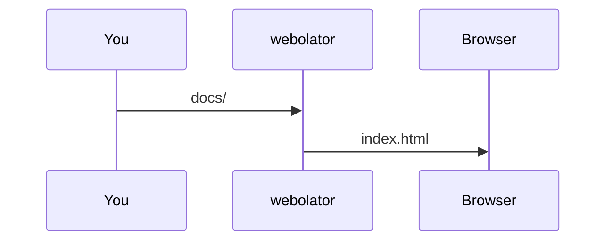
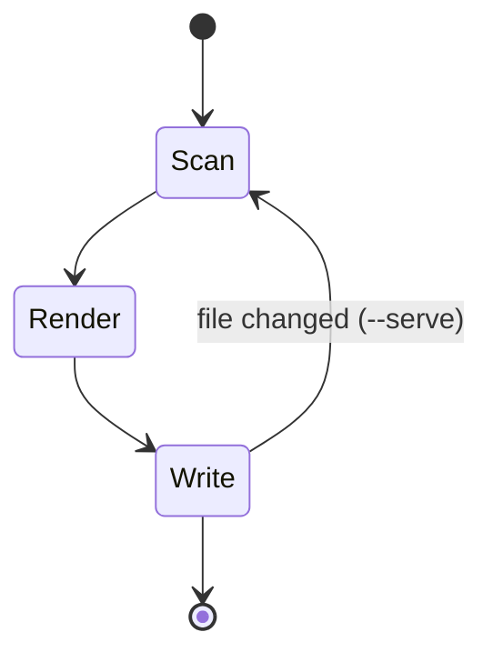

# Mermaid diagrams

A fenced code block whose language is `mermaid` becomes a diagram:

````markdown

````


Diagrams follow the page's light or dark mode.

## Another example



## Offline use

By default mermaid.js is loaded from the jsDelivr CDN, and only on pages that contain a diagram. To avoid the network entirely, pass a local copy:

```bash
webolator docs/ --single --mermaid-js mermaid.min.js
```

In a static build the file is copied to `_webolator/`. With `--single` it is inlined into the output file.
