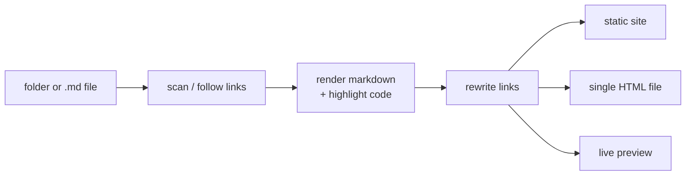

# webolator

**Point it at a folder of markdown and get a website.** No config file, no index file, no `SUMMARY.md`.

This site is itself built by webolator from the [`docs/`](https://github.com/vivainio/webolator/tree/main/docs) folder of the repository. See [Publishing to GitHub Pages](04-publishing.md) for how.

```bash
uvx webolator docs/ --serve
```

## How it works



## Features

- **Zero config.** The sidebar comes from the directory tree, and page titles come from each file's first `# heading`.
- **[Mermaid diagrams](03-features/01-mermaid.md)** are rendered in the browser.
- **[Syntax highlighting](03-features/02-highlighting.md)** happens at build time, with light and dark themes.
- **[Cross-file links](02-links.md)** to `.md` files, folders and headings are rewritten to the right place.
- **Sibling files** (raw HTML, text, PDFs, images) are kept and linked.
- **[Single-file output](03-features/03-single-file.md)** puts a whole folder of docs into one `.html` file.
- **Live reload** with `--serve`.

## See it in action

- **[The demo site](https://vivainio.github.io/webolator/demo/)** is built from [`examples/demo`](https://github.com/vivainio/webolator/tree/main/examples/demo). It shows raw HTML, log and PDF files next to the markdown.
- **[This documentation as a single file](https://vivainio.github.io/webolator/webolator-docs.html)** is every page of these docs in one self-contained HTML file.

## Install

```bash
uv tool install webolator
```

Pre-built binaries are also on the [releases page](https://github.com/vivainio/webolator/releases). Continue with [Usage](01-usage.md).
