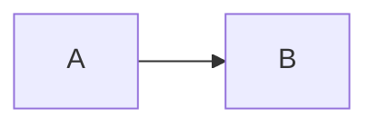

# Syntax reference

Every markdown form webolator understands, each with its source and how it renders on this page. Anything not listed here is standard [CommonMark](https://commonmark.org).

## Text

| Form | Source | Result |
|---|---|---|
| Bold, italic | `**bold**`, `*italic*` | **bold**, *italic* |
| Strikethrough | `~~gone~~` | ~~gone~~ |
| Inline code | `` `code` `` | `code` |
| Emoji shortcode | `:rocket: :tada: :+1:` | :rocket: :tada: :+1: |
| Inline math | `$a^2 + b^2 = c^2$` | $a^2 + b^2 = c^2$ |
| Keyboard (raw HTML) | `<kbd>Ctrl</kbd>+<kbd>C</kbd>` | <kbd>Ctrl</kbd>+<kbd>C</kbd> |

Emoji shortcodes use GitHub's names. A shortcode that isn't recognized is left as typed.

## Links

| Form | Source |
|---|---|
| Link to another page | `[Usage](01-usage.md)` |
| Link to a heading | `[ordering](01-usage.md#ordering)`, or `[text](#links)` on the same page |
| Link to a folder | `[features](03-features/)` goes to that folder's index page |
| Root-relative link | `[x](/01-usage.md)`, relative to the docs root |
| Wikilink | `[[Usage]]`, `[[03-features/01-mermaid]]`, `[[Usage\|custom text]]`, `[[Usage#Ordering]]`, `[[#Links]]` |
| Autolink | `https://example.com` and `www.example.com` become links |
| Any other file | `[log](build.log)`, `[spec](spec.pdf)`, `[report](report.html)` |

For example, `[[Usage#Ordering]]` renders as [[Usage#Ordering]]. See [Links](02-links.md) for how each form is rewritten and [Wikilinks](03-features/05-writing.md#wikilinks) for how names are matched.

## Headings

`#` to `######`. Each heading gets a GitHub-style anchor id, so `## Step two` gets `#step-two`. The first `#` heading is the page title. The `##` and `###` headings fill the "On this page" sidebar.

## Lists

````markdown
- bullet
  1. numbered, nested
- [x] a done task
- [ ] an open task
````

- bullet
  1. numbered, nested
- [x] a done task
- [ ] an open task

## Tables

````markdown
| Left | Center | Right |
|:-----|:------:|------:|
| a    |   b    |     c |
````

| Left | Center | Right |
|:-----|:------:|------:|
| a    |   b    |     c |

Inside a table, write `\|` for a literal `|`.

## Quotes and alerts

````markdown
> A plain quote.

> [!NOTE]
> Useful information.
````

> A plain quote.

The five GitHub alert types:

> [!NOTE]
> `> [!NOTE]`: useful information.

> [!TIP]
> `> [!TIP]`: a helpful suggestion.

> [!IMPORTANT]
> `> [!IMPORTANT]`: something the reader must know.

> [!WARNING]
> `> [!WARNING]`: needs attention.

> [!CAUTION]
> `> [!CAUTION]`: a risk of something going wrong.

## Footnotes

````markdown
A claim.[^source]

[^source]: The footnote text, collected at the bottom of the page.
````

A claim.[^source]

[^source]: The footnote text, collected at the bottom of the page.

## Code blocks

````markdown
```python
print("hello")
```
````

```python
print("hello")
```

The word after the fence can be a language name or a file extension. It's case-insensitive, so `python`, `py`, `Rust` and `rs` all work. These languages are highlighted:

ActionScript, AppleScript, ASP, Batch (`bat`, `cmd`), BibTeX, Bash (`bash`, `sh`, `zsh`), C, C#, C++, Clojure, CSS, D, Diff (`diff`, `patch`), Erlang, Go, Graphviz (`dot`), Groovy, Haskell, HTML, Java, Java properties, JavaScript (`js`), JSON, LaTeX (`tex`), Lisp, Lua, Makefile, Markdown, MATLAB, Objective-C, OCaml, Pascal, Perl, PHP, Python (`py`), R, reStructuredText, Ruby, Rust (`rs`), Scala, SQL, Tcl, Textile, XML, YAML (`yml`).

Anything else, including TypeScript, TOML, Dockerfile, Kotlin and Swift, is shown as plain text. Every code block gets a copy button.

## Diagrams

A ```` ```mermaid ```` block is drawn with [Mermaid](https://mermaid.js.org): flowcharts, sequence, class, state and ER diagrams, Gantt charts and more.

````markdown

````


## Math

| Form | Source |
|---|---|
| Inline | `$e^{i\pi} + 1 = 0$` |
| Display | `$$\sum_{n=1}^{\infty} \frac{1}{n^2} = \frac{\pi^2}{6}$$` |
| Display block | a ```` ```math ```` fenced block |

$$\sum_{n=1}^{\infty} \frac{1}{n^2} = \frac{\pi^2}{6}$$

```math
\begin{aligned}
f(x) &= (x + 1)^2 \\
     &= x^2 + 2x + 1
\end{aligned}
```

Math is rendered with [KaTeX](https://katex.org/docs/supported.html). As on GitHub, a `$` followed by a digit doesn't close math, so "costs $5 and $10" stays plain text.

## Images

`` or raw ``. Both get their paths rewritten and are inlined in `--single` output. Click an image to zoom.

## Raw HTML

HTML is passed through as is, so `<details>`, `<kbd>`, `<sub>`, `<sup>`, `<br>` and `` all work. `href` and `src` attributes in it are rewritten like markdown links.

<details>
<summary>A collapsible section (<code>&lt;details&gt;</code>)</summary>

Content that stays hidden until the summary is clicked.

</details>

## Front matter

An optional block at the very top of a file:

```yaml
---
title: Shown in the sidebar and browser tab
order: 3
hidden: true
---
```

These are the only fields, and any others are ignored. See [Front matter](03-features/05-writing.md#front-matter). This page uses it (`title` and `order: 3`) to sit between Links and the features folder.

## Special file names

| Name | Meaning |
|---|---|
| `README.md`, `index.md` | the folder's home page (`index.md` wins if both exist) |
| `01-name.md`, `02-folder/` | number prefix: sets the order, hidden from labels and URLs |
| `webolator.css` (in the root) | [custom styles](03-features/04-styling.md), applied automatically |
| `.webolatorignore` | [files to leave out](01-usage.md#leaving-files-out), in gitignore syntax |
| `.gitignore`, `.ignore` | honored by default, `--no-ignore` turns them off |
