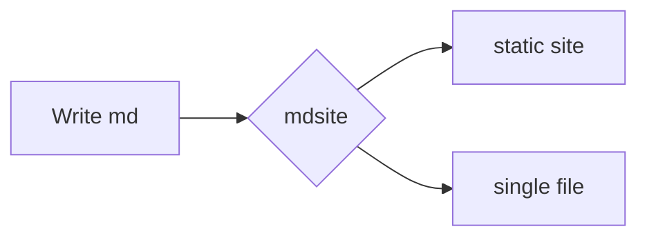

# Project Docs

Welcome. See the [guide](guide/), [setup section](guide/install.md#quick-setup), [notes](my%20notes/ideas.md),
the [raw report](report.html), [log file](build.log), [a pdf](spec.pdf) and [root-rel](/guide/install.md).

 inline html image, and 

Jump [down](#flow).

## Flow

> [!NOTE]
> Alerts work too.

- [x] task done
- [ ] todo

| a | b |
|---|---|
| 1 | 2 |

Footnote[^1].

[^1]: The footnote.
